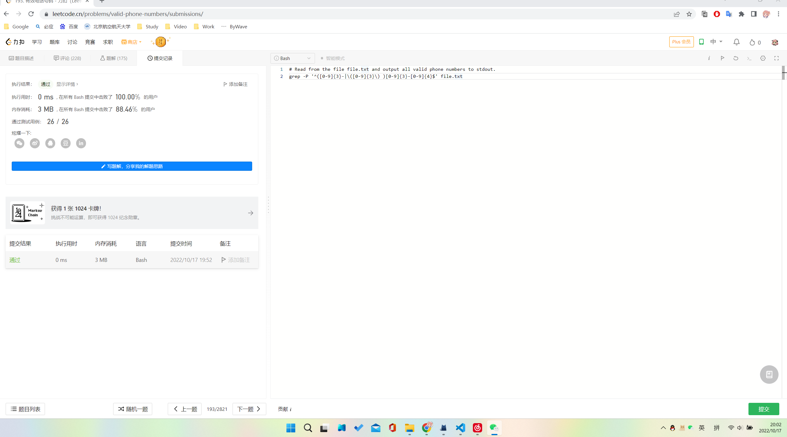
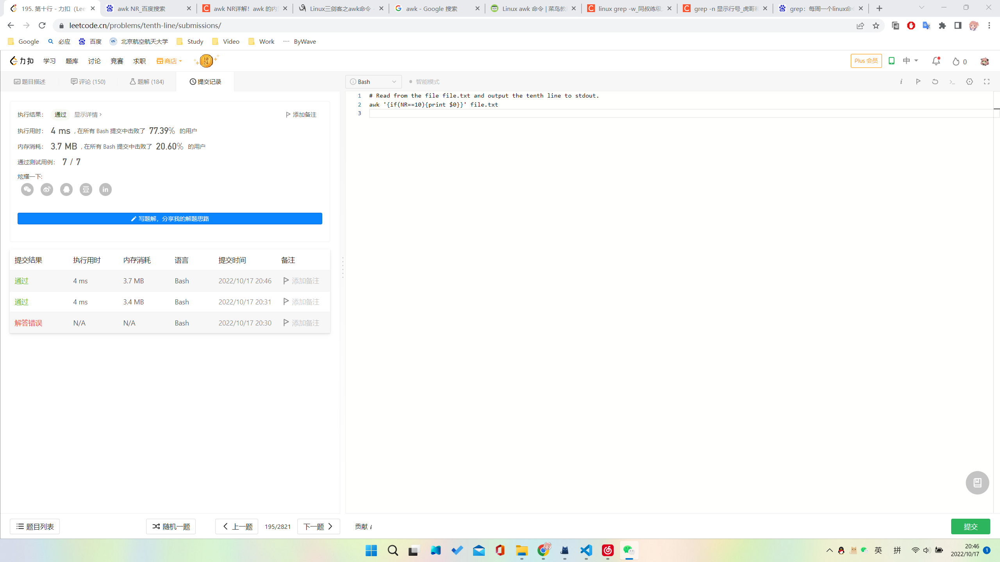

# Lab03 - Assignment

> 姓名：
> 学号：

## 1. 基础

### 1.1 权限

对一个文本文件`file.txt`执行命令：`sudo chmod 777 file.txt`。请解释该命令的含义并写出执行该命令后该文件的权限信息。

>表示将test.txt文件的读、写、执行权限赋权给所有的用户。

### 1.2 管道、重定向

现有文件`a.txt`，文件内容为

```
Welcome to linux!
```

和文件`f1`，文件内容为

```
Hello World!
```

解释以下命令`cat a.txt | cat >>f1 2>&1`的原理,同时给出执行完命令后f1文件中的内容

> cat a.txt输出是a.txt里面所有的内容，由管道|成为cat >>f1的输入，2>&1则是重定向错误输出

```
Hello World!
Welcome to linux!
```
### 1.3 环境变量

自己添加一个环境变量，名称是`STUDENT_ID`，值为你的学号，并编写一个C程序来获取该环境变量，并打印出来。**请详细叙述你的操作过程以及操作过程的截图，并给出C程序的代码。**


```c
#include <stdio.h>
#include <stdlib.h>

int main() 
{
    const char* SID = "STUDENT_ID";
    printf("$STUDENT_ID = %s\n", getenv(SID));
    return 0;
}
```

## 2. Shell 编程

### 2.1 脚本解释器

假如在脚本的第一行放入`#!/bin/rm`或者在普通文本文件中第一行放置`#!/bin/more`，然后将文件设为可执行权限执行，看看会发生什么，并解释为什么。

> 

### 2.2 任何位置都可以运行的 Bash

编写一个 bash 脚本，执行该脚本文件将得到两行输出，第一行是你的学号，第二行是当前的日期（考虑使用`date`命令）。

要求：

- 用户可以**在任意位置只需要输入文件名**就可以执行该脚本文件
- **不破坏除用户家目录之外的任何目录结构**，即不要在家目录之外的任何地方增删改任何文件

你的 bash 脚本文件内容：

```bash
#!/bin/bash
echo $STUDENT_ID
date
```

除编写该文件之外你进行了哪些操作？

> PATH=$PATH:/home/leonard/Desktop

### 2.3 Bash 实战 (1)

完成 [LeetCode: 193. Valid Phone Numbers](https://leetcode.com/problems/valid-phone-numbers/)，并提供你的 AC 代码与截图。

AC 代码：

```bash
grep -P '^([0-9]{3}-|\([0-9]{3}\) )[0-9]{3}-[0-9]{4}$' file.txt
```

AC 截图：



### 2.4 Bash 实战 (2)

完成 [LeetCode: 195. Tenth Line](https://leetcode.com/problems/tenth-line/)，并提供你的 AC 代码与截图。

AC 代码：

```bash
awk '{if(NR==10){print $0}}' file.txt
```

AC 截图：



### 2.5 Bash 实战 (3) 

编写一个文件 `manage.sh`，其用法如下：

```bash
manage.sh OPERATION
```

其中：

- 参数 OPERATION 有以下选项：
  - `mine`：输出当前路径下（不包括子目录）所有者为当前用户的所有文件名
  - `largest`：输出当前路径下（不包括子目录）最大文件的文件名
  - `expand`**（选做）**：递归地将当前目录中所有文件（无论在哪个子文件夹中）全部移动至当前目录下，并删除所有子文件夹。

对于 `expand` 操作，举个例子：

假设 `/root/lab03` 结构如下：

```bash
/root/lab03/
	|------ a.txt
	|------ b.txt
	|------ c/
			|------ d.txt
			|------ e.txt
	|------ f/
			|------ g/
					|------ h.txt
```

运行 `./manage.sh expand` 后，其结构将变为：

```
/root/lab03/
	|------ a.txt
	|------ b.txt
    |------ d.txt
    |------ e.txt
    |------ h.txt
```

你的代码：

```bash
#!/bin/bash
Cur_Dir=$(pwd)
loggedName="leonard"
case $1 in
mine)
ls -l $Cur_Dir | grep $loggedName | awk '{printf $9 "\n"}'
;;
largest)
ls -l $Cur_Dir | sort -nr -k5 | head -1 | awk '{printf $9 "\n"}'
*)
echo "Not found command"
;;
esac
```


