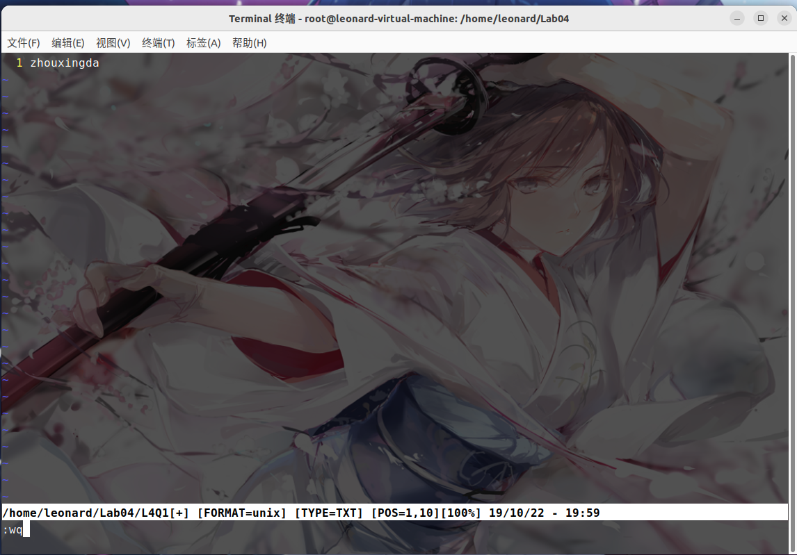
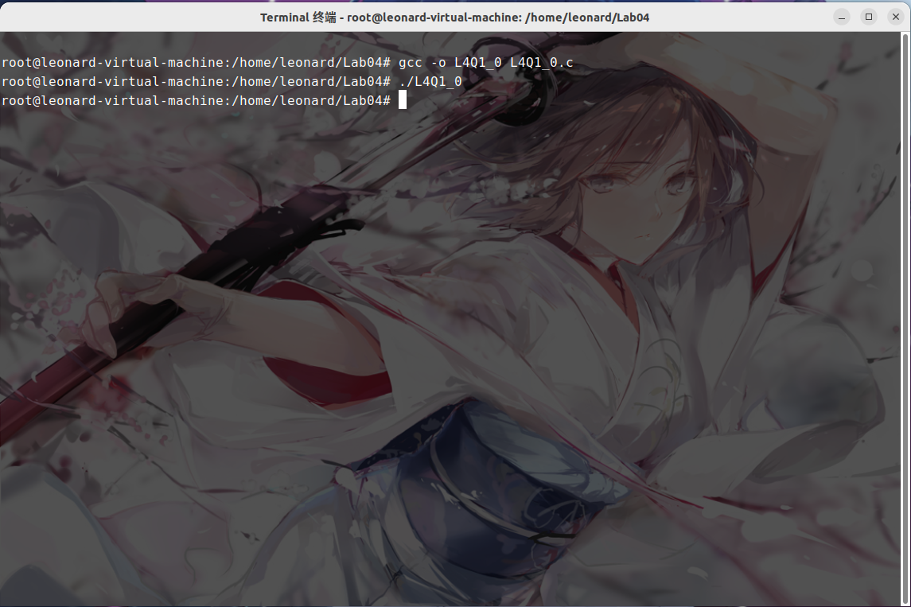
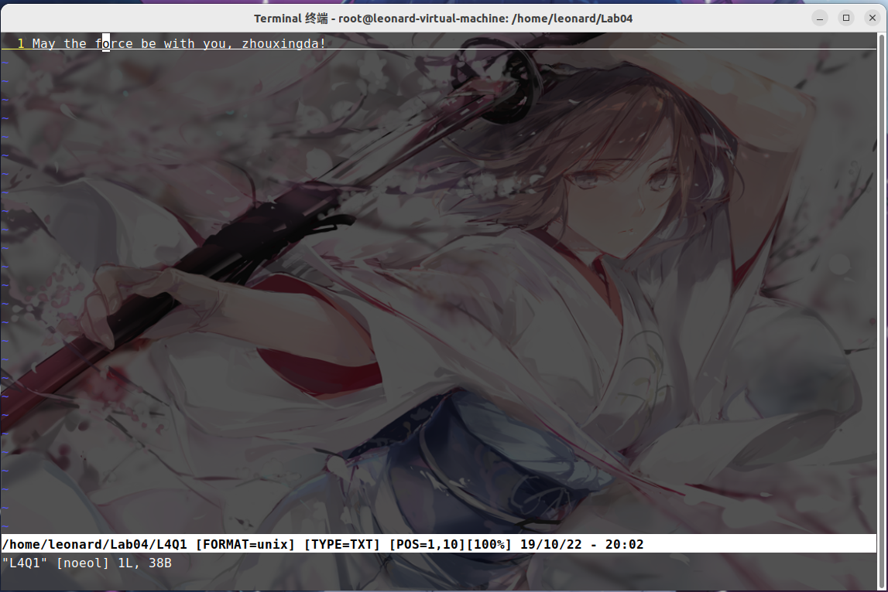
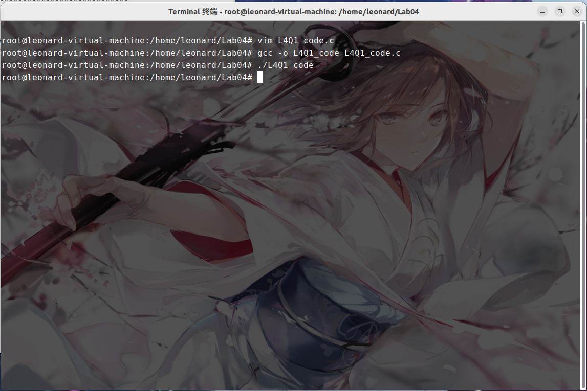
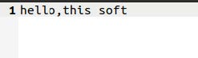
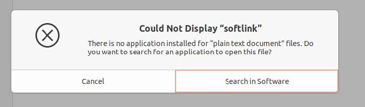

# Lab04 - Assignment

> 姓名：周星达
> 学号：21373339

## 1. 文件 I/O 函数

(1)创建一个文件，内容为你的姓名的全拼（如张三同学，文件中的内容即为`zhangsan`)。编写 c 语言程序实现以下功能：首先打开该文件并输出文件的内容，之后将文件的内容修改为`May the force be with you, ${姓名全拼}!`，比如`May the force be with you, zhangsan!`，输出修改后文件的内容，最后关闭文件。要求使用到`open()` `read()` `write()` `close()`函数。请详细叙述你的操作过程以及操作过程的截图，并给出你所编写的 C 程序的代码。





```c
#include<stdio.h>
#include<fcntl.h>
#include<sys/types.h>
#include<stdlib.h>
#include<unistd.h>
int main()
{
	int f1,n;
	int i=0;
	f1=open("L4Q1",O_RDONLY);
	char name[20];
	char buf;
	int temp;
	char sub[]="May the force be with you, ";
	n=read(f1,name,20);
	close(f1);

	f1=open("L4Q1",O_WRONLY|O_TRUNC);
	temp=write(f1,sub,27);
	temp=write(f1,name,n-1);
	buf='!';
	temp=write(f1,&buf,1);
	close(f1);
}
```

(2)使用`fopen()` `fread()` `fwrite()` `fclose()`函数再次实现上述要求。请详细叙述你的操作过程以及操作过程的截图，并给出你所编写的 C 程序的代码。





```c
#include<stdio.h>
#include<string.h>

int main()
{
	FILE *temp;
	temp = fopen("L4Q1","r");
	char name[20];
	int n;
	n=fread(name,1,20,temp);
	fclose(temp);
	char sub[]="May the force be with you, ";
	temp = fopen("L4Q1","w");
	fwrite(sub,1,27,temp);
	fwrite(name,1,n-1,temp);
	char buf='!';
	fwrite(&buf,1,1,temp);
	fclose(temp);
	return 0;
}
```
## 2. 目录

编写一个 myls 程序，要求输入一个参数代表指定目录，例如./listdir/，打印目录下所有文件的名称。

（Hint：参考课本例 4-8）

```c
#include <sys/types.h>
#include <dirent.h>
#include <stdio.h>
int main (int ac, char **av)
{
    DIR * dir_ptr;
    struct dirent *dir;
    if(ac<2) 
    {
        printf ("usage : listdir directoryname") ;
        exit (1) ;
    }
    dir_ptr = opendir(av[l]);
    if (dir_ptr!=NULL) 
    {
        while ((dir=readdir(dir_ptr) )!=NULL)
        {
            printf ("%s\n",d主r->d_name) ;
        }
        closedir(dir_ptr);
    }
    return 0;
}
```

## 3.  链接

（1）创建文件`~/srcfile`，使用 `ln` 命令创建 `srcfile` 的软链接文件 `~/softlink` ，给出使用的命令；使用 `ls -l` 查看 `~` ，观察 `softlink` 的文件大小，并解释为什么；使用 `ln` 命令创建 `srcfile`的硬链接文件 `~/hardlink` ，给出使用的命令；使用 `ls -l` 观察 `srcfile` 硬链接数的变化。

>ln -s srcfile softlink

>ln srcfile hardlink

（2）查看`srcfile`链接文件的索引节点号和文件内容。接下来修改源文件、硬链接文件、软链接文件，查看其他两个文件内容的变化。然后删除源文件，观察硬链接文件和软链接文件的变化，请给出操作过程的截图以及得出的结论。

>三个文件都会改动，但删除源文件后软链接文件会失效；
结论：硬链接实际上是和源文件完全相同的文件，而软链接则是创造了一个有不同inode的文件。
