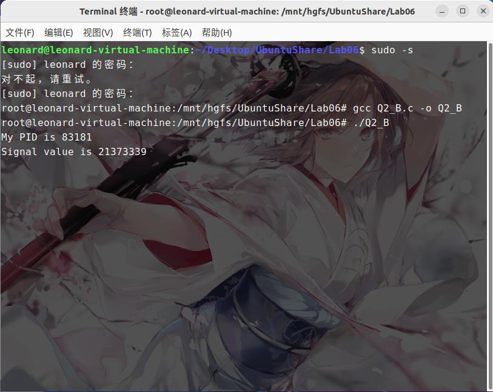

# Lab06 Assignment

> 班级：212112
> 学号：21373339
> 姓名：周星达

## 1. 请简述信号什么时候处于未决状态，并简述信号存在未决状态的作用

## 2. 编写程序实现如下功能

程序 A.c 通过 sigqueue()函数按用户输入向程序 B.c 发送信号和**你的学号**作为附加数据；B.c 程序接收到该信号后，输出伴随信号的附加数据(**即你的学号**)。运行过程如下：

```sh
./B & # 此时，输出进程 B 的 PID 号。
./A processB_PID 19373075 # 第一个参数表示进程 B 的 PID，第二个参数为你的学号。
```

```c
//code of A
#include <unistd.h>
#include <signal.h>
#include <stdio.h>
#include <sys/types.h>
#include <stdio.h>
#include <stdlib.h>


int main(int argc, char* argv[])
{
    int pid=atoi(argv[1]);
    int ID=atoi(argv[2]);
    sigqueue(pid,SIGINT,(union sigval)ID);
    return 0;
}
```

```c
//code of B
#include <unistd.h>
#include <signal.h>
#include <stdio.h>
#include <sys/types.h>
#include <stdlib.h>

void sigHandler(int sig, siginfo_t *info, void *ucontext)
{
    printf("Signal value is %d\n", info->si_value.sival_int);
}

int main()
{
    int pid=getpid();
    printf("My PID is %d\n", pid);
    struct sigaction act;
    act.sa_sigaction = sigHandler;
    act.sa_flags = SA_SIGINFO;
    sigaction(SIGINT, &act, NULL);
    while (1)
    {
        sleep(1);
    }
    return 0;
}
```




## 3. 请实现这样一个程序

程序每间隔 1 秒输出你的学号，当按下 ctrl+c 后，程序询问是否退出程序（此时停止输出学号），输入 Y 或 5 秒未进行任何输入则退出程序，输入 N 程序恢复运行，继续输出学号（提示：alarm()函数设置超时时间，SIGALRM 信号处理函数作为超时处理）。

```c
#include <stdlib.h>
#include <stdio.h>
#include <string.h>
#include <signal.h>
#include <unistd.h>
#include <sys/types.h>

char s;

void stop(int sigNum)
{
    exit(0);
}

void input()
{
    scanf("%c", &s);
    if (s == 'N')
    {
        alarm(0);
    }
    else
    {
        exit(0);
    }
}

void ask(int sigNum)
{
    printf("If stop the program? (Y/N)\n");
    signal(SIGALRM, stop);
    alarm(5);
    input();
}

int main()
{
    signal(SIGINT, ask);
    while (1)
    {
        printf("21373339\n");
        sleep(1);
    }
}
```

## 4. 请实现这样一个程序

在程序中创建一个子进程，通过信号实现父子进程交替输出，父进程输出学号，子进程输出姓名，要求父进程先输出。

```c
#include <stdlib.h>
#include <stdio.h>
#include <string.h>
#include <signal.h>
#include <unistd.h>
#include <sys/types.h>


pid_t pid_p, pid_c;
void ID(int sigNum)
{
    printf("21373339\n");
    sleep(1);
    kill(pid_c, SIGALRM);
}

void Name(int sigNum)
{
    printf("Leonard Zhou\n");
    sleep(1);
    kill(pid_p, SIGINT);
}

int main(int argc, char **argv)
{
    signal(SIGINT, ID);
    signal(SIGALRM, Name);
    int status;
    pid_p = getpid();
    pid_c = fork();
    if (pid_c == 0)//child
    {
        sleep(1);
        kill(pid_p, SIGINT);
    }
    else
    {   
        sleep(2);
        kill(pid_c, SIGALRM);
    }
    while (1)
        ;
}
```


## 5. 父子进程

父进程等待子进程退出通常仅需调用 wait()函数，但如果子进程未退出，父进程将会一直处于阻塞态,并通过循环不断获取子进程状态，该回收子进程的方式是对 CPU 资源的浪费。子进程终止时会自动向父进程发送 SIGCHLD 信号，请通过该特性实现这样一个程序：父进程创建 5 个子进程，每个子进程输出 PID 后以不同的状态值退出，父进程使用 SIGCHLD 信号实现异步回收子进程(非忙等)，每回收一个子进程就输出该子进程的 PID 和退出状态值，需要保证任何情况下所有子进程都能回收（提示：SIGCHLD 是不可靠信号，不支持排队，考虑两个子进程同时结束的情况）

提示：利用waitpid与sleep而不是wait，实现非忙等回收子进程。

```c
#include <stdio.h>
#include <unistd.h>
#include <time.h>
#include <signal.h>
#include <sys/wait.h>
#include <stdlib.h>

int status;

void catch (int sigNum)
{
    pid_t wpid;

    while ((wpid = waitpid(-1, &status, WNOHANG)) > 0)
    {
        printf("father wait son pid is %d\n Exit code is %d\n", wpid, status);
    }
}

int main()
{

    sigset_t myset, oldset;
    sigemptyset(&myset);
    sigaddset(&myset, SIGCHLD);
    sigprocmask(SIG_BLOCK, &myset, &oldset);
    pid_t pid;
    int i;
    for (i = 0; i < 5; ++i)
    {
        pid = fork();
        if (pid == 0)
        {
            break;
        }
    }
    if (i == 5)
    {

        sleep(2);
        struct sigaction act;
        act.sa_flags = 0;
        sigemptyset(&act.sa_mask);
        act.sa_handler = catch;
        sigaction(SIGCHLD, &act, NULL);

        sigprocmask(SIG_SETMASK, &oldset, NULL);
        while (1)
        {
            sleep(1);
        }
    }
    else if (i < 5)
    {
        printf("son process pid is %d\n", getpid());
        exit(i);
    }
    return 0;
}


```

## 6. 异步信号安全函数

异步信号安全函数(async-signal-safe function)是可以在信号处理函数中安全调用的函数，即一个函数在返回前被信号中断，并在信号处理函数中再次被调用，均可以得到正确结果。通常情况下，不可重入函数(non-reentrant function)都不是异步信号安全函数，都不应该在信号处理函数中调用。

1. 思考: 异步信号安全/不安全函数 和 不可/可重入函数有什么关系？

   ```
   异步信号安全函数是指当信号处理器函数调用时，可以保证其实现是安全的。如果某一函数是可重入
   的，又或者信号处理器函数无法将其中断时就称该函数是异步信号安全的。
   ```
2. 请判断下面的函数是否是异步信号安全函数，如果是请说明理由，如果不是请给出一种可能发生问题的情况。

   ```c
   int tmp;
   void swap1(int* x, int* y)
   {
      tmp = *x;
      *x = *y;
      *y = tmp;
   }
   ```
   ```
   不是，因为tmp是全局变量，假如swap1在执行过程中被中断，此时程序转而执行其他的任务，并且另一个任务也调用了swap1，那就就有可能更改swap1中变量的值，当程序回到第一个任务时，swap1中变量的值可能与原来不同了，会产生错误。
   ```
   ```c
   void swap2(int* x, int* y)
   {
      int tmp;
      tmp = *x;
      *x = *y;
      *y = tmp;
   }
   ```
   ```
   是，tmp是局部变量，在调用退出时会自动清空，不会影响下次调用，不同任务不同调用也不会产生错误。
   ```
3. 由于 printf()函数使用全局缓冲区，因此它不是异步信号安全函数。为了避免可能发生的问题，其中一个解决方法是在调用 printf()函数前阻塞所有信号，并在调用后恢复。请用上述思路补全代码，实现 printf()的异步信号安全版本，无需实现格式化输出（提示：sigprocmask()函数可用于阻塞多个信号）。

   ```c
   //code
    void print_safe()
    {
        //TODO:阻塞所有信号
        signet_t newset,oldset;
        sigfillset(&newset);
        sigprocmask(SIG_BLOCK,&newset,&oldset);
        printf("safe print!\n")
        //TODO:恢复所有信号
        sigprocmask(SIG_SETMASK,&oldset,NULL);
    }
   ```
