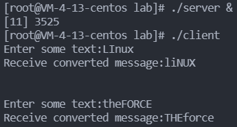
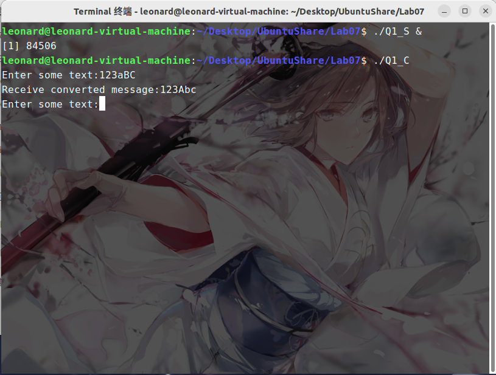
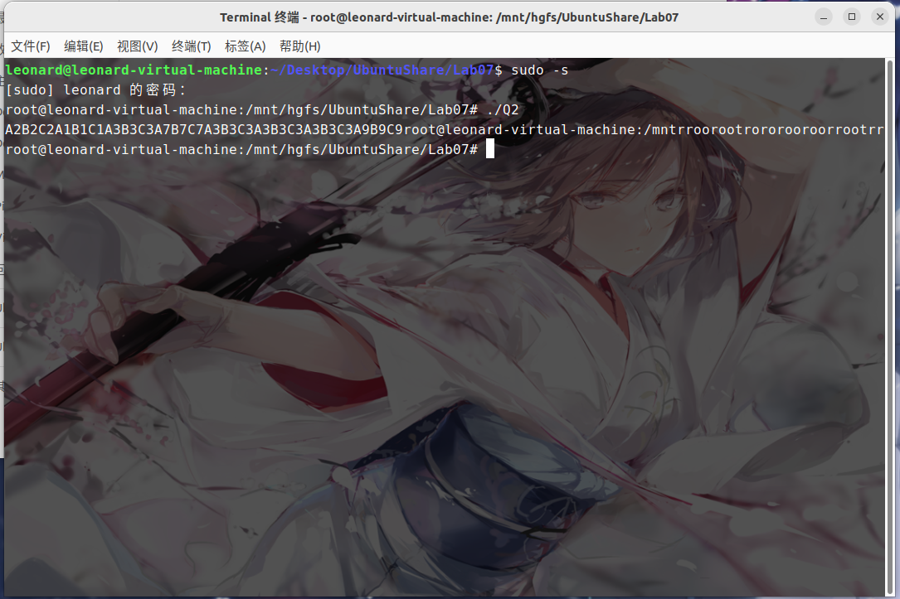
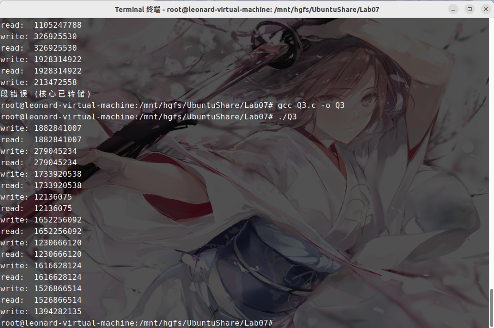

# Lab07 Assignment

> 班级：212112
> 学号：21373339
> 姓名：周星达

## 1. 请实现这样一个程序

请实现这样一个程序：客户端进程（Client）和服务器进程（Server）通过**消息队列**进行通信，消息队列共有两个，Up 和 Down，如下图所示：


客户端进程接受用户从终端的输入，并通过 Up 消息队列将消息传递给服务器进程，然后等待服务器进程从 Down 消息队列传回消息。服务器进程从 Up 接收到消息后**将大小写字母转换**，并通过 Down 传回给客户端进程，客户端随后输出转换后的消息。（例如：客户端通过 Up 发送'linuX', 将从 Down 接收到'LINUx'）。多个客户端同时使用 Up 和 Down 消息队列时也应该能够正常工作，因此需要使用消息类型 mtype 区分来自不同客户端的消息。要求程序输出如下的效果：



```c
// client.c  code
#include <sys/msg.h>
#include <sys/types.h>
#include <sys/ipc.h>
#include <stdio.h>
#include <sys/errno.h>
#include <string.h>
#include <unistd.h>
extern int errno;
struct mymsgbuf1
{
    long mtype;
    char ctext[100];
};
struct mymsgbuf
{
    long mtype;
    pid_t pid;
    char ctext[100];
};
void main()
{
    struct mymsgbuf buf;
    struct mymsgbuf1 buf1;
    int msgid, ret;
    pid_t pid = getpid();
    if ((msgid = msgget(0x1234, 0666 | IPC_CREAT)) < 0)
    {
        fprintf(stderr, "open msg %x failed.\n", 0x1234);
        return;
    }
    while (1)
    {
        memset(&buf, 0, sizeof(buf));
        printf("Enter some text:");
        scanf("%s", buf.ctext);

        buf.mtype = 1;
        buf.pid = pid;
        while ((msgsnd(msgid, &buf, strlen(buf.ctext) + sizeof(buf.pid), 0)) < 0)
        {
            if (errno == EINTR)
                continue;
            return;
        }
        memset(&buf1, 0, sizeof(buf1));
        while ((ret = msgrcv(msgid, &buf1, sizeof(buf1.ctext), pid, 0)) < 0)
        {
            if (errno == EINTR)
                continue;
            return;
        }
        printf("Receive converted message:%s", buf1.ctext);
        printf("\n");
    }
}


```

```c
// server.c  code
#include <sys/msg.h>
#include <sys/types.h>
#include <sys/ipc.h>
#include <stdio.h>
#include <sys/errno.h>
#include <string.h>
#include <unistd.h>
extern int errno;
struct mymsgbuf1
{
    long mtype;
    char ctext[100];
};
struct mymsgbuf
{
    long mtype;
    pid_t pid;
    char ctext[100];
};
void main()
{
    struct mymsgbuf buf;
    struct mymsgbuf1 buf1;
    int msgid, ret, i, len;
    if ((msgid = msgget(0x1234, 0666 | IPC_CREAT)) < 0)
    {
        fprintf(stderr, "open msg %x failed.\n", 0x1234);
        return;
    }
    while (1)
    {
        memset(&buf, 0, sizeof(buf));
        while ((ret = msgrcv(msgid, &buf, sizeof(buf.ctext) + sizeof(buf.pid), 1, 0)) < 0)
        {
            if (errno == EINTR)
                continue;
            return;
        }
        memset(&buf1, 0, sizeof(buf1));

        len = strlen(buf.ctext);
        for (i = 0; i < len; i++)
        {
            if (buf.ctext[i] >= 'A' && buf.ctext[i] <= 'Z')
                buf1.ctext[i] = buf.ctext[i] + 32;
            else if (buf.ctext[i] >= 'a' && buf.ctext[i] <= 'z')
                buf1.ctext[i] = buf.ctext[i] - 32;
            else
                buf1.ctext[i] = buf.ctext[i];
        }
        buf1.mtype = buf.pid;
        while ((msgsnd(msgid, &buf1, strlen(buf1.ctext), 0)) < 0)
        {
            if (errno == EINTR)
                continue;
            return;
        }
    }
}
```



## 2. 请实现这样一个程序

请实现这样一个程序：一个进程创建 3 个子进程A、B、C，每个子进程都打印你的学号，但要求每个进程都打印完这一位数字后，才能有进程开始下一位数字的打印，并且进程打印顺序按照进程A、B、C依次打印，**在打印的数字前加上A、B、C**。例如，我的学号是 `19373075`，那么输出结果应该是 `A1B1C1A9B9C9A3B3C3A7B7C7A3B3C3A0B0C0A7B7C7A5B5C5`。仅允许使用**信号量**作为同步工具。

```c
#include <stdio.h>
#include <unistd.h>
#include <sys/mman.h>
#include <fcntl.h>
#include <semaphore.h>

sem_t *sem1, *sem2, *sem3;
int a[8] = {2, 1, 3, 7, 3, 3, 3, 9};
pid_t pid, pid0, pid1;

int main(int argc, char **argv)
{
    sem_t *sem1, *sem2, *sem3;
    sem1 = (sem_t *)mmap(NULL, sizeof(sem_t), PROT_READ | PROT_WRITE, MAP_SHARED | MAP_ANON, -1, 0);
    sem_init(sem1, 1, 1);
    sem2 = (sem_t *)mmap(NULL, sizeof(sem_t), PROT_READ | PROT_WRITE, MAP_SHARED | MAP_ANON, -1, 0);
    sem_init(sem2, 1, 0);
    sem3 = (sem_t *)mmap(NULL, sizeof(sem_t), PROT_READ | PROT_WRITE, MAP_SHARED | MAP_ANON, -1, 0);
    sem_init(sem3, 1, 0);
    char *ch;
    ch = (char *)mmap(NULL, sizeof(char) * 2005, PROT_READ | PROT_WRITE, MAP_SHARED | MAP_ANON, -1, 0);
    int *temp;
    temp = (int *)mmap(NULL, sizeof(int), PROT_READ | PROT_WRITE, MAP_SHARED | MAP_ANON, -1, 0);
    pid = fork();

    if (pid == 0)
    {
        for (int i = 0; i < 8; i++)
        {
            if (sem_wait(sem1) == 0)
            {
                ch[*temp] = 'A';
                (*temp)++;
                ch[*temp] = a[i] + '0';
                (*temp)++;
                sem_post(sem2);
            }
        }
    }
    else
    {
        pid1 = fork();
        if (pid1 == 0)
        {

            for (int i = 0; i < 8; i++)
            {
                if (sem_wait(sem2) == 0)
                {
                    ch[*temp] = 'B';
                    (*temp)++;
                    ch[*temp] = a[i] + '0';
                    (*temp)++;
                    sem_post(sem3);
                }
            }
        }
        else
        {

            for (int i = 0; i < 8; i++)
            {
                if (sem_wait(sem3) == 0)
                {
                    ch[*temp] = 'C';
                    (*temp)++;
                    ch[*temp] = a[i] + '0';
                    (*temp)++;
                    sem_post(sem1);
                }
            }
            ch[*temp] = '\0';
            printf("%s", ch);
        }
    }

    sem_destroy(sem1);
    sem_destroy(sem2);
    sem_destroy(sem3);
}

```



## 3. 请实现这样一个程序

在《Linux 编程基础》一书对共享内存的讲解中，其给出的例子是一个进程向共享内存写，然后终止，然后再启动一个进程从共享内存中读。请实现这样一个程序：同时使用**信号量**和**共享内存**实现一个这样的功能，同时运行两个进程A和B，A进程向共享内存中写入数据后阻塞，等待B进程读，读完之后A再写，然后B再读……。要求程序输出如下的效果：


一共要求输出 10 组，30 行，`read`行之后有一空行，以便于明显区分组别；`write`和 `read`后面的数字请不要显示明显的规律性，请使用 `rand()`函数获取，并一定在调用 `rand()`函数之前，使用 `srand(unsigned int seed)`重置随机种子，其中，`seed`为你的学号。

```c
#include <stdio.h>
#include <unistd.h>
#include <sys/mman.h>
#include <fcntl.h>
#include <semaphore.h>
#include <sys/mman.h>
#include <stdlib.h>
#include <time.h>
sem_t *sem1, *sem2, *sem3;
pid_t pid;

int main(int argc, char **argv)
{
    sem_t *sem1, *sem2;
    sem1 = (sem_t *)mmap(NULL, sizeof(sem_t), PROT_READ | PROT_WRITE, MAP_SHARED | MAP_ANON, -1, 0);
    sem_init(sem1, 1, 1);
    sem2 = (sem_t *)mmap(NULL, sizeof(sem_t), PROT_READ | PROT_WRITE, MAP_SHARED | MAP_ANON, -1, 0);
    sem_init(sem2, 1, 0);
    int *data;
    data = (int *)mmap(NULL, sizeof(int), PROT_READ | PROT_WRITE, MAP_SHARED | MAP_ANON, -1, 0);

    pid = fork();
    srand((int)time(NULL));
    if (pid == 0)
    {
        for (int i = 0; i < 10; i++)
        {
            if (sem_wait(sem1) == 0)
            {
                *data = rand();
                printf("write: %d\n", *data);
                sem_post(sem2);
            }
        }
    }
    else
    {
        for (int i = 0; i < 8; i++)
        {
            if (sem_wait(sem2) == 0)
            {
                printf("read:  %d\n", *data);
                sem_post(sem1);
            }
        }
    }
    sem_destroy(sem1);
    sem_destroy(sem2);
    munmap(data,sizeof(int));
    return 0;
}
```


