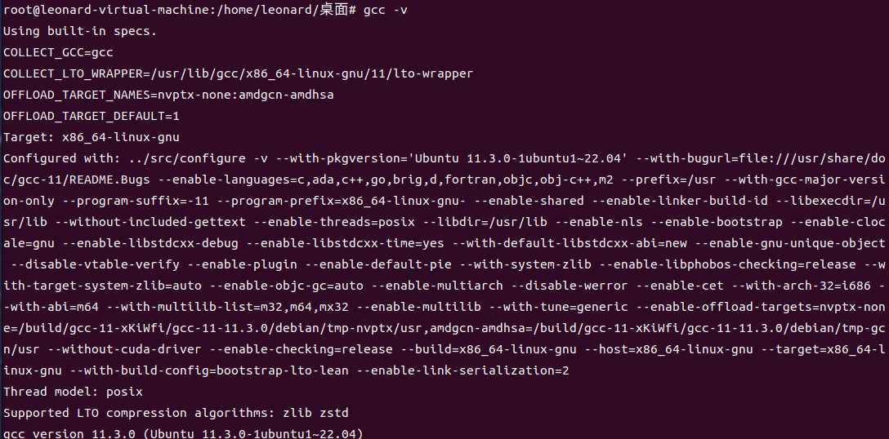
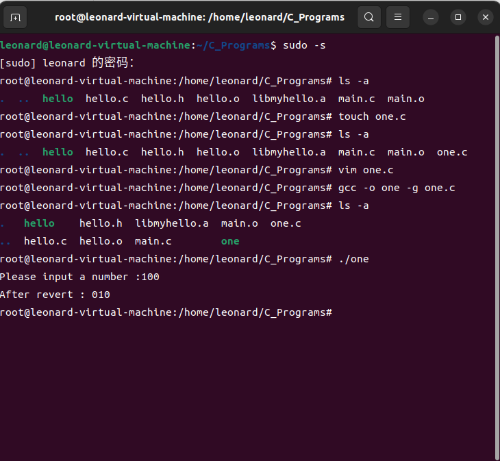
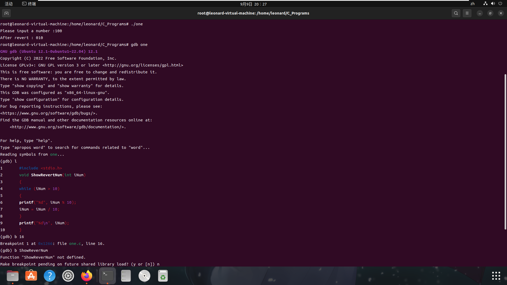

# Week02 Assignment

> 姓名：周星达
> 学号：21373339

## 1. 安装 GCC、GDB、Make 工具，并查看各工具的版本。

你的系统是什么发行版？安装用什么命令？如何查看上述三个工具的版本？截图各工具的版本。
22.04 LTS;apt-get;gcc -v,gdb -v, make -v
> 



## 2. 练习使用 GCC。

编译过程有哪几个步骤？这些步骤分别用什么选项实现？
> 
预处理、编译、汇编和链接
预处理就是展开所有的头文件、替换程序中的宏、解析条件编译并添加到文件中。
编译是将经过预编译处理的代码编译成汇编代码，也就是我们常说的程序编译。
汇编就是将汇编语言文件编译成二进制目标文件。
链接就是将汇编出来的多个二进制目标文件链接在一起，形成最终的可执行文件。
gcc [选项] [文件名字]
主要选项如下：
    -c： 只编译不链接为可执行文件，编译器将输入的.c 文件编译为.o 的目标文件。
    -o： <输出文件名>用来指定编译结束以后的输出文件名，如果不使用这个选项的话 GCC 默认编译出来的可执行文件名字为 a.out。
    -g： 添加调试信息，如果要使用调试工具(如 GDB)的话就必须加入此选项，此选项指示编译的时候生成调试所需的符号信息。
    -O： 对程序进行优化编译，如果使用此选项的话整个源代码在编译、链接的的时候都会进行优化，这样产生的可执行文件执行效率就高。
    -O2： 比-O 更幅度更大的优化，生成的可执行效率更高，但是整个编译过程会很慢。

## 3. 静态链接库和动态链接库有何异同？如何生成？

> 
采用静态链接方式实现链接操作的库文件称为静态链接库；采用动态链接方式实现链接操作的库文件称为动态链接库。
GCC 编译器生成可执行文件时，默认情况下会优先使用动态链接库实现链接操作，除非当前系统环境中没有程序文件所需要的动态链接库，GCC 编译器才会选择相应的静态链接库。如果两种都没有（或者 GCC 编译器未找到），则链接失败。

静态库：1.将.c文件编译成.o文件 
```
gcc -c source.c
```
2.将.o文件编译成.a文件（静态库文件）
```
ar -rc libsource.a source.o
```
3.加入gcc编译
```
gcc main.c libsource.a -o main
```


动态库：1.把.c文件编译成.so动态库
```
gcc -fpic -shared source.c -o libsource.so
```
2.在工程编译的时候，将动态库的路径和名字（source）加载进来
```
gcc main.c -o project  -L ./ -lsource
```
3.执行时候系统会自动去(/lib)中查找该库文件

## 4. 练习使用 GDB。

编写一个 C 程序，并自行调试，将关键步骤截图。

> 



## 5. 练习使用 Make。

简述 `make` 工具的功能。

> make工具则可自动完成编译工作，并且可以只对程序员在上次编译后修改过的部分进行编译。因此，有效的利用make和makefile
工具可以大大提高项目开发的效率。同时掌握make和makefile之后，您也不会再面对着Linux下的应用软件手足无措了。
利用make工具，我们可以将大型的开发项目分解成为多个更易于管理的模块

请阐述 `make` 如何确定哪些文件需要重新生成，而哪些不需要生成。

> make在当前目录下寻找“Makefile”或“makefile”文件
若找到，查找文件中的第一个目标文件.o
若目标文件不存在，根据依赖关系查找.s文件
若.s文件不存在，根据依赖关系查找.i文件
若.i文件不存在，根据依赖关系查找.c文件，此时.c文件一定存在，于是生成一个.o文件，再去执行


学习 `make` 的规则，并指出 Makefile 中 `.PHONY` 的作用。

> make [option] [macrodef] [target]
option指出make的工作行为，make的主要选项有：
-c dir     make在开始运行后的工作目录为指定目录
-f filename      使用指定的文件作Makefile

>.PHONY是一个伪目标，Makefile中将.PHONY放在一个目标前就是指明这个目标是伪文件目标。其作用就是防止在Makefile中定义的执行命令的目标和工作目录下的实际文件出现名字冲突。


## 6. 实验准备

从下周开始，我们将进行系统编程的实验。一部分实验需要下载一些文件，我们将使用 `wget` 来下载。

### 6.1 安装 wget、unzip

你的系统使用什么指令安装？

> apt-get

### 6.2 unzip 解压

使用什么指令解压一个名为 `practice.zip` 的压缩包？

> unzip practice.zip